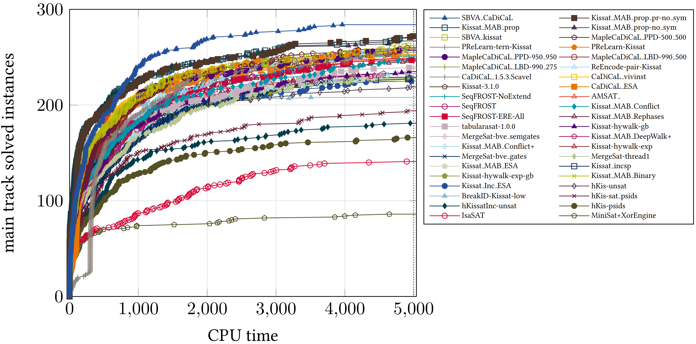

# The Top Three SAT Solvers of 2023

The [SAT 2023](https://satcompetition.github.io/2023/index.html) conference proceedings can be found [here](https://helda.helsinki.fi/server/api/core/bitstreams/6c4161a1-6889-4503-a366-2e0dd25b99a7/content), and the results/slides can be found [here](https://satcompetition.github.io/2023/downloads/satcomp23slides.pdf).

---

The winners of the main track were:
1. [SBVA CaDiCaL](https://tuhat.helsinki.fi/ws/files/269128852/sc2023_proceedings.pdf#page=18)
2. [Kissat MAB prop](https://tuhat.helsinki.fi/ws/files/269128852/sc2023_proceedings.pdf#page=16)
3. [Maple CaDiCaL PPD 500 500](https://tuhat.helsinki.fi/ws/files/269128852/sc2023_proceedings.pdf#page=30)



##SAT Winner Details
|   | Solver                    | Authors                                   | PAR-2   | Solved |
|---|---------------------------|-------------------------------------------|---------|--------|
| 1 | sbva_cadical              | Andrew Haberlandt and Harrison Green      | 3274.01 | 284    |
| 2 | kissat_mab_prop           | Yu Gao                                    | 3596.73 | 272    |
| 3 | maple_cadical_ppd_500_500 | Jonathan Chung, Sam Buss and Vijay Ganesh | 3933.51 | 260    |

The source code of the solvers was taken from the [SAT 2021 repository](https://github.com/satcompetition/2023/blob/main/downloads/Sequential.tar.xz).

---
## Usage
To use the SAT solvers within a Linux machine, enter the following:
```bash
# Compile the SAT solvers
./compile_SATs.sh

# Run the default "simple.cnf" file against all the SAT solvers
./run_SATs.sh

# Run any DIMACS file against all the SAT solvers
./run_SATs.sh PATH_TO_SAT_INSTANCE.cnf
```

---

## Web-based version
For an easy-to-use web based SAT solver, visit https://github.com/simewu/SAT-solver.
